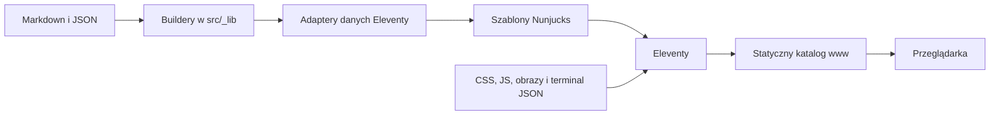
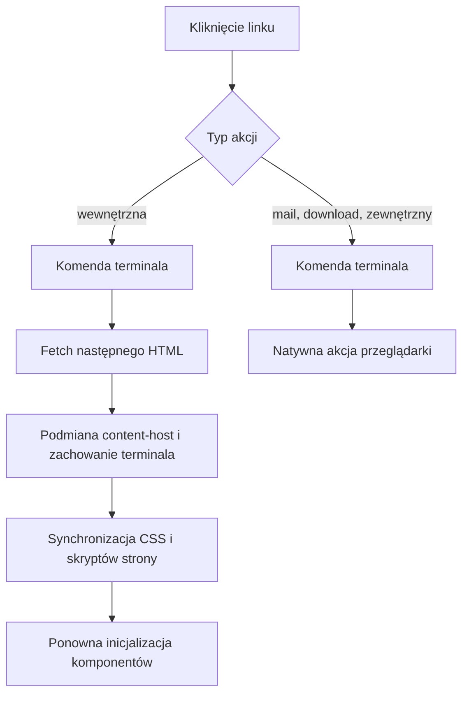

# Architektura fmmaciej.com

## Cel dokumentu

Ten dokument opisuje wysokopoziomowe działanie `fmmaciej.com`: sposób budowania
statycznych stron, przepływ danych i treści, zachowanie kodu w przeglądarce oraz
proces przygotowania i publikowania materiałów muzycznych.

Źródłem prawdy jest katalog `src/`. Eleventy generuje z niego kompletną stronę
w `www/`. Katalog wynikowy nie jest edytowany ani przechowywany w Git.

## Przegląd systemu

Projekt jest statyczną stroną opartą na Eleventy 3. Nie używa bundlera ani
frameworka frontendowego. Warstwa serwerowa działa wyłącznie podczas budowania,
a przeglądarka otrzymuje gotowy HTML, CSS, klasyczny JavaScript i zasoby
multimedialne.



System ma dwie wyraźne fazy:

1. **Build-time** — Eleventy zbiera treści, buduje view modele, renderuje
   szablony i kopiuje zasoby do `www/`.
2. **Runtime** — przeglądarka obsługuje motyw, terminal, menu mobilne,
   rozwijane kolekcje i animowane przejścia między wygenerowanymi stronami.

## Główne obszary strony

| Trasa | Odpowiedzialność |
| --- | --- |
| `/` | Profil software engineer, treść z fragmentu Markdown. |
| `/projects/` | Lista projektów z globalnego katalogu JSON. |
| `/blog/` | Archiwum wpisów pogrupowane według roku i miesiąca. |
| `/blog/<slug>/` | Pojedynczy wpis Markdown. |
| `/music/` | Punkt wejścia do części muzycznej i press kitu. |
| `/music/bio/`, `/music/rider/` | Strony tekstowe z fragmentów Markdown. |
| `/music/mixes/` | Miksy planowane, najnowsze i pogrupowane według platformy. |
| `/music/events/` | Nadchodzące wydarzenia oraz archiwum dekad i lat. |
| `/music/events/<wydarzenie>/` | Materiały przypisane do jednego wydarzenia. |
| `/music/photos/` | Zestawy zdjęć pogrupowane według roku. |
| `/music/links/` | Redakcyjny katalog odnośników muzycznych. |
| `/sitemap.xml`, `/robots.txt` | Automatycznie generowane dane dla robotów. |
| `/llms.txt` | Dobrowolna polityka bez spoilerów dla zewnętrznych modeli. |

## Organizacja źródeł

Najważniejsze katalogi:

- `src/_includes/` — wspólny layout, layout wpisu blogowego i makra Nunjucks;
- `src/_data/` — cienkie adaptery Eleventy oraz surowe katalogi JSON;
- `src/_lib/` — czyste buildery view modeli i narzędzia do rozwiązywania mediów;
- `src/blog/`, `src/music/`, `src/projects/`, `src/me/` — szablony i treści
  poszczególnych sekcji;
- `src/assets/css/` — style bazowe, komponentowe, efekty i style tras;
- `src/assets/js/` — klasyczny JavaScript wykonywany w przeglądarce;
- `src/assets/terminal/` — wersjonowana konfiguracja idle, globalne profile i
  pule poleceń oraz kontekstowe sekwencje poszczególnych tras;
- `src/assets/music/` — wygenerowane warianty obrazów oraz fallbacki;
- `tests/` — testy builderów, shella, koordynatorów runtime i smoke test builda;
- `docs/` — architektura, kontrakt terminala i backlog porządków technicznych;
- `tools/` — lokalne narzędzia generujące katalogi, obrazy i press kit;
- `www/` — wynik builda, nigdy źródło zmian.

## Przepływ danych podczas builda

### Zasada ogólna

Dane przechodzą przez cztery warstwy:

```text
surowe źródło → czysty builder w src/_lib → cienki adapter Eleventy → szablon
```

Builder odpowiada za normalizację, sortowanie, grupowanie oraz utworzenie view
modelu. Nie mutuje wejścia. Adapter jedynie wczytuje źródło, uruchamia builder i
eksportuje wynik. Szablon zajmuje się renderowaniem, a nie obliczeniami
domenowymi.

### Blog

`.eleventy.js` tworzy kolekcję `blog` ze wszystkich opublikowanych wpisów w
`src/blog/posts/`. Wpisy z `draft: true` są wykluczane z kolekcji i nie tworzą
własnej strony.

Lokalny adapter `src/blog/index.11tydata.js` przekazuje kolekcję do
`buildBlogArchive`. Builder tworzy strukturę `rok → miesiąc → wpisy`, którą
renderuje `src/blog/index.njk`. Adapter jest lokalny, ponieważ tylko strona
archiwum potrzebuje tego view modelu i zależy on od `collections.blog`.

### Events, mixes i photos

Surowe katalogi `events.json`, `mixes.json` oraz `photos.json` mają wspólny
szkielet:

- `defaults` — ustawienia kolekcji;
- `items` — pola redakcyjne i relacje domenowe;
- `media` — wygenerowane dane techniczne obrazów.

Każda domena ma osobny builder:

- `buildEventData` rozwiązuje media, tworzy upcoming/archive, grupy lat i dekad
  oraz dane używane przez strony szczegółów;
- `buildMixData` przygotowuje daty prezentacyjne, fallbacki, planned/latest i
  grupy platform;
- `buildPhotoData` normalizuje dane autorów, łączy zestawy z mediami i grupuje
  je według roku.

Adaptery `eventData.js`, `mixData.js` i `photoData.js` eksportują gotowe obiekty
dla Nunjucks. `allEvents.js` udostępnia `eventData.all` mechanizmowi paginacji,
który generuje po jednej stronie na wydarzenie.

### Pozostałe dane

Projekty i linki muzyczne są prostymi katalogami JSON konsumowanymi bez
rozbudowanej transformacji. `site.js` przechowuje publiczny adres strony używany
między innymi przez sitemapę.

## Renderowanie Eleventy

`.eleventy.js` konfiguruje:

- katalog wejściowy `src/` i wyjściowy `www/`;
- Nunjucks jako silnik szablonów;
- Markdown-it wraz z regułami dla linków zewnętrznych, ZIP i PDF;
- kolekcję bloga;
- filtry dat i miniaturek YouTube;
- shortcode `importMd`, który osadza wybrany fragment Markdown w szablonie;
- passthrough copy dla CSS, JavaScriptu, ikon, terminal JSON i muzycznych
  wariantów WebP.

Każda publiczna strona ma frontmatter z layoutem, permalinkiem oraz opcjonalnie:

- `terminalFile` — konfiguracją terminala dla danej trasy;
- `pageStyles` — stylami dołączanymi tylko na tej stronie;
- `pageScripts` — skryptami strony;
- `collectionPage` — deklaratywną konfiguracją rozwijanych kolekcji.

Wspólny `layout.njk` tworzy nagłówek, nawigację, terminal, `<main>`, stopkę,
menu mobilne i zestaw skryptów bazowych. Szablony stron dostarczają jedynie
zawartość `<main>`.

## Działanie w przeglądarce



### Terminal

Terminal ma dwa tryby: pasywny animator idle oraz aktywny, deterministyczny
shell. Idle miesza komendy kontekstowe z globalnymi, resetuje cykl przy zmianie
trasy i zaczyna od lokalnego przykładu. Zwykła rotacja zachowuje proporcję dwie
komendy lokalne na jedną globalną, a co szósta prezentacja pochodzi z osobnej
puli Matrixa. Nazwane profile sterują tempem, a sekwencyjny scheduler czeka na
pełne zakończenie outputu lub efektu i pozwala anulować cały cykl.

Idle nadal tłumaczy zwykłe kliknięcia na `cd`, `cat`, `open` lub `wget`. Active
udostępnia read-only, linuksowy filesystem zbudowany z publicznych treści
strony, historię, autouzupełnianie i nawigację za pomocą komend. `cmatrix`
korzysta w obu trybach ze wspólnego, wyspecjalizowanego helpera canvas.

Manifest filesystemu powstaje podczas builda przez czysty builder w
`src/_lib/terminal/` i jest publikowany jako
`/assets/terminal/filesystem.json`. Nawigacja zachowuje DOM oraz sesję terminala
między trasami zamiast tworzyć komponent od nowa. Manifest jest pobierany lazy
przy pierwszej aktywacji. Współdzielony koordynator zapewnia pojedynczą
inicjalizację, trwały stan błędu i retry bez przeładowania strony.

Pełny opis subsystemu, komend, trwałości sesji i granic bezpieczeństwa znajduje
się w [docs/terminal.md](terminal.md).

### Animowane przejścia

`transitions.js` przechwytuje obsługiwane linki wewnętrzne. Skrypt:

1. anuluje starszą, niezakończoną nawigację;
2. pobiera następny dokument przez `fetch`;
3. parsuje HTML bez pełnego przeładowania;
4. synchronizuje `pageStyles` i `pageScripts`;
5. wykonuje cleanup terminala i skryptów strony;
6. podmienia `.content-host`, zachowując istniejący terminal i jego sesję;
7. aktualizuje historię i ponownie inicjalizuje komponenty;
8. uruchamia animację wejścia treści.

Jeśli View Transitions API jest dostępne, aktualizacja jest wykonywana wewnątrz
przejścia. Bez tego API zachowany zostaje ten sam częściowy przepływ, ale bez
animacji przeglądarkowej. Zmiana wyłącznie hasha omija pobieranie dokumentu.
Zwykła nawigacja jest fallbackiem dla błędu sieci, HTTP, parsowania, wymaganych
assetów lub dokumentu bez oczekiwanej struktury. Nieaktualna odpowiedź nigdy nie
zmienia DOM ani historii.

### Rozwijane kolekcje

Blog, events, mixes i photos używają wspólnego makra opartego na semantycznym
`<details>`. Konfiguracja z `collectionPage` trafia jako `data-*` na `<main>`, a
`page-boot.js` inicjalizuje komponent bez rozpoznawania konkretnych tras.

`collection-page.js` odpowiada za animacje, aktywną grupę, hashe URL i suffix
ścieżki terminala. Przy bezpośrednim wejściu na zagnieżdżony hash otwiera także
grupy nadrzędne. Blog nie synchronizuje grup z URL ani terminalem; events,
mixes i photos robią to zgodnie z konfiguracją. Wewnętrzne zestawy zdjęć
pozostają natywnymi `<details>`.

### Pozostałe komponenty

- `theme.js` przełącza motyw, a wybór jest zapisywany w `localStorage`; przy
  braku wyboru używany jest motyw systemowy;
- `nav.js` obsługuje mobilny drawer, backdrop, klawiaturę i atrybuty ARIA;
- `loader.js` i `boot.js` realizują efekty wejściowe;
- animacje respektują `prefers-reduced-motion`.

## CSS i zasoby

CSS jest ładowany bez bundlowania i podzielony według odpowiedzialności:

- `base/` — tokeny, layout i reguły globalne;
- `components/` — terminal, nawigacja, kolekcje, karty i inne elementy wspólne;
- `effects/` — boot, Markdown i przejścia;
- `sections/` — style właściwe dla konkretnych tras.

Layout ładuje style bazowe zawsze, a `pageStyles` tylko tam, gdzie są potrzebne.
Obrazy muzyczne mają zapisane w katalogach wymiary i warianty używane przez
`srcset`. Font Awesome jest ładowany z zewnętrznego CDN, a brakująca lokalna
miniatura miksu YouTube może wskazywać na `img.youtube.com`. Śledzone zasoby
projektu są serwowane jako pliki statyczne.

## Workflow mediów muzycznych

Źródłowe obrazy znajdują się lokalnie w ignorowanych katalogach `originals/`.
Ich nazwy są częścią kontraktu danych:

```text
YYYYMMDD__slug__NN.ext
shared__slug__NN.ext   # tylko współdzielone obrazy miksów
```

Polecenia `build:events`, `build:mixes` i `build:photos` wykonują kolejno:

1. walidację nazw i katalogu;
2. generowanie wariantów WebP przez lokalne narzędzie photos4web;
3. odczyt wymiarów i hashy;
4. połączenie danych technicznych z polami redakcyjnymi;
5. atomowy zapis JSON.

Hash źródła pozwala zachować pola redakcyjne po zmianie nazwy pliku. Events i
photos generują warianty `480`, `960`, `1600`, a mixes `480`, `960`.
Wygenerowane pliki oraz odpowiadający im JSON są częścią źródeł strony.

`bundle:press-kit` buduje deterministyczny ZIP z bio, ridera, notatek o miksach,
danych kontaktowych i zdjęć. `npm run rebuild` regeneruje media, katalogi i
press kit przed właściwym buildem Eleventy; dlatego może zmienić wiele plików.

## Budowanie, testowanie i publikacja

Najważniejsze polecenia:

| Polecenie | Zastosowanie |
| --- | --- |
| `npm ci` | Instalacja zależności zgodnie z lockfile. |
| `npm run dev` | Serwer developerski Eleventy z obserwowaniem zmian. |
| `npm run build` | Standardowy build `src/` → `www/` i zapis hasha źródeł. |
| `npm test` | Wszystkie testy danych, terminala i runtime. |
| `npm run test:data` | Testy czystych builderów i adapterów danych. |
| `npm run test:terminal` | Testy filesystemu, komend, sesji, selektora idle, profili, schedulera, modelu Matrixa i spójności treści. |
| `npm run test:runtime` | Testy anulowania/fallbacku nawigacji, lazy init, retry i bootu. |
| `npm run test:smoke` | Kontrola wygenerowanego HTML po `npm run build`. |
| `npm run rebuild` | Pełna regeneracja mediów, danych, press kitu i strony. |
| `python3 -m unittest discover -s tools/tests -v` | Lokalne testy synchronizacji katalogów. |

Po zmianach wizualnych lub interakcyjnych sam build nie wystarcza — należy
sprawdzić stronę w przeglądarce, w tym mobile, jasny/ciemny motyw, klawiaturę i
ograniczenie ruchu.

Publikacja jest oddzielona od builda. `deploy:check` wymaga gałęzi `main`,
czystego drzewa, zgodności z `origin/main` i aktualnego `www/build.txt`.
`deploy:ovh` tworzy tymczasowe repozytorium z zawartością `www/` i publikuje je
na gałęzi `ovh-deploy`. Poleceń deploy nie należy uruchamiać jako zwykłej części
walidacji.

## Typowe punkty rozszerzania

- **Nowa strona tekstowa:** szablon z frontmatter i fragment Markdown; style lub
  skrypty zadeklarować przez `pageStyles`/`pageScripts`.
- **Nowy wpis blogowy:** plik Markdown w `src/blog/posts/`; `draft: true`
  pozostawia go poza buildem publicznym.
- **Nowa kolekcja danych:** surowe źródło, czysty builder w `_lib`, cienki
  adapter Eleventy i szablon konsumujący stabilny view model.
- **Nowa rozwijana kolekcja:** użyć istniejącego makra oraz `collectionPage`;
  nie dodawać warunków zależnych od URL do `page-boot.js`.
- **Nowe media muzyczne:** użyć odpowiedniej konwencji nazw i polecenia
  `build:<collection>` zamiast ręcznej edycji pól technicznych.
- **Nowe zachowanie przeglądarkowe:** zachować klasyczny skrypt, inicjalizację
  odporną na brak elementu oraz cleanup zgodny z animowaną nawigacją.

## Najważniejsze niezmienniki

- `src/` jest źródłem prawdy; `www/` jest jednorazowym wynikiem builda.
- Logika domenowa nie trafia do szablonów ani adapterów danych.
- Surowe katalogi zachowują pola redakcyjne podczas regeneracji mediów.
- Wewnętrzna nawigacja musi działać również bez View Transitions API.
- Starsza nawigacja nie może nadpisać DOM ani historii po rozpoczęciu nowszej;
  błędy runtime muszą wracać do klasycznej nawigacji.
- Manifest shella jest pobierany dopiero przy aktywacji, a nie podczas startu
  strony; błąd musi pozostawiać możliwość ponowienia.
- Komponenty przeglądarkowe muszą być bezpieczne po wielokrotnej inicjalizacji i
  zwalniać listenery, obserwatory i timery.
- Zmiany dostępności, responsywności i obu motywów wymagają weryfikacji w
  przeglądarce.
