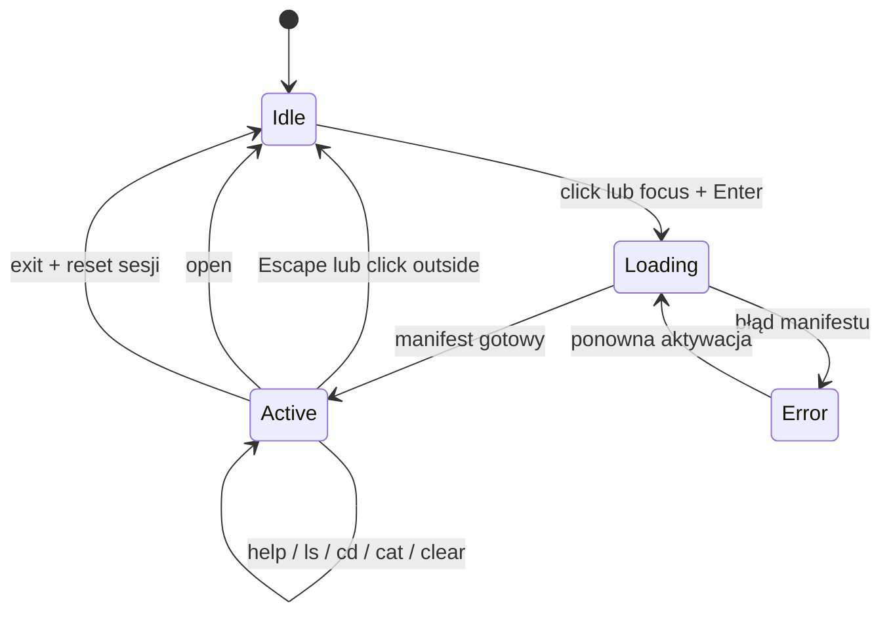
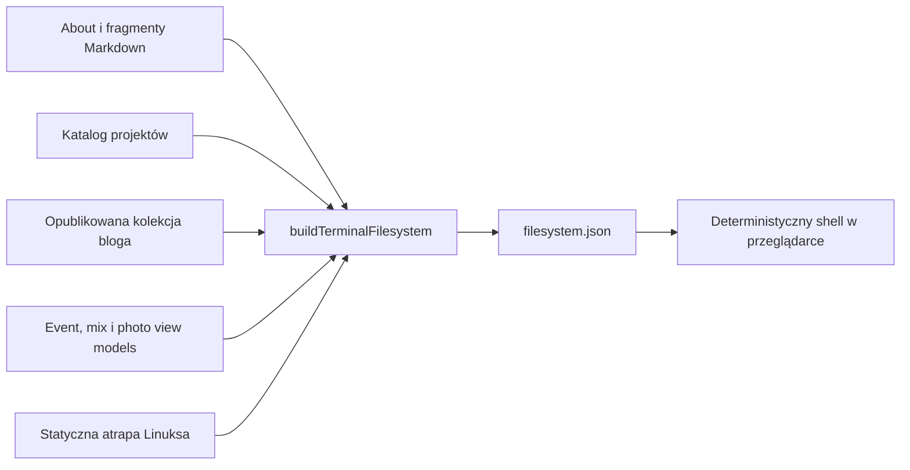

# Terminal portfolio

## Cel dokumentu

Ten dokument opisuje wysokopoziomową architekturę terminala na
`fmmaciej.com`: jego dwa tryby wizualne, wirtualny system plików, deterministyczny
shell, integrację z nawigacją strony oraz granice odpowiedzialności komponentów.

Terminal jest alternatywnym interfejsem do publicznego portfolio. Nie zastępuje
klasycznej nawigacji i nie jest emulatorem prawdziwego systemu operacyjnego.
Strona pozostaje w pełni użyteczna bez aktywowania shella.

## Założenia produktu

Terminal realizuje trzy cele:

1. Buduje terminalowy charakter portfolio bez wymuszania interakcji.
2. Pozwala eksplorować te same publiczne treści za pomocą znajomych poleceń.
3. Tworzy bezpieczną, deterministyczną podstawę pod przyszłą komendę `ask`.

Aktualna wersja nie zawiera AI. Nie wykonuje prawdziwych programów, nie zapisuje
plików, nie ma dostępu do systemu użytkownika i nie interpretuje dowolnego kodu.

## Dwa tryby interfejsu

### Idle

Idle jest domyślnym stanem po wejściu na stronę. Terminal ma stałą wysokość i
odtwarza deterministyczną mieszankę komend kontekstowych, wspólnych dla całej
strony oraz rzadkich easter eggów Matrixa. Odpowiedzi są wyświetlane jako
subtelna warstwa w tle treści strony.

Najważniejsze własności:

- stała wysokość zapobiega przesuwaniu layoutu przez dłuższe komendy;
- wersjonowana konfiguracja animacji pochodzi z `src/assets/terminal/`;
- każda podstrona zaczyna od lokalnej komendy, a zwykła rotacja zachowuje rytm
  dwie lokalne na jedną globalną;
- co szósta prezentacja pochodzi z osobnej, deterministycznej puli Matrixa;
- pula Matrixa rotuje efekt, cinematic message i symboliczną komendę; ASCII-art
  królika pozostaje dostępny wyłącznie przez ręczną eksplorację shella;
- nazwane profile `standard`, `cinematic` i `ambient` sterują tempem prezentacji;
- scheduler czeka na pełne zakończenie outputu lub efektu przed wyborem kolejnej
  komendy i pozwala anulować cały cykl jednym sygnałem;
- animacja nie przechwytuje klawiatury;
- hover i fokus klawiatury pokazują delikatną, odsuniętą ramkę sugerującą
  możliwość aktywacji;
- ścieżka terminala odzwierciedla bieżącą trasę strony;
- przykłady używają wyłącznie poleceń i ścieżek dostępnych w aktywnym shellu.

#### Konfiguracja idle

Globalny `src/assets/terminal/config.json` ma `schemaVersion: 2` i definiuje
politykę `selection`, nazwane `timingProfiles` oraz pule `pools.common` i
`pools.matrix`. Konfiguracja każdej trasy ma własne `schemaVersion: 2` i tablicę
`contextual`; nie powiela ustawień globalnych.

Tempo wpisu powstaje przez nałożenie wbudowanego profilu `standard`, wybranego
profilu z konfiguracji i opcjonalnych nadpisań konkretnej komendy. Nieznana
nazwa profilu wraca do `standard` i generuje pojedyncze ostrzeżenie w konsoli.
Brak puli kontekstowej powoduje użycie globalnej, a brak globalnej — użycie
kontekstowej. Błędna konfiguracja idle nie może blokować aktywnego shella ani
klasycznej strony.

### Loading, error i active shell

Kliknięcie terminala albo ustawienie na nim fokusu i naciśnięcie Enter/Space
zatrzymuje idle i dopiero wtedy pobiera manifest filesystemu. W trakcie tej
pierwszej próby terminal zachowuje stałą wysokość i pokazuje status ładowania.
Udany odczyt jest współdzielony przez kolejne aktywacje i tworzy dokładnie jeden
kontroler shella.

Jeśli manifest jest chwilowo niedostępny, terminal pozostaje zwinięty i pokazuje
stały komunikat błędu. Kliknięcie, Enter lub Space ponawia pobranie bez
przeładowania strony. Błąd shella nie blokuje klasycznej nawigacji portfolio.

Po udanym odczycie terminal rozwija się nad treścią strony, bez zmiany wysokości
dokumentu. Aktywny obszar otrzymuje wyraźniejszą ramkę, pełne tło, transcript i
pole polecenia.

Shell pozostaje otwarty dla poleceń eksploracyjnych. Zamyka się po:

- `open`, gdy udało się otworzyć stronę lub zasób;
- `exit`, które dodatkowo usuwa zapisaną sesję;
- Escape;
- kliknięciu poza terminalem.

Escape i kliknięcie poza terminalem zachowują sesję. Ponowne otwarcie przywraca
katalog roboczy, historię oraz transcript.



## Architektura build-time

Wirtualny filesystem nie jest ręcznie utrzymywaną kopią portfolio. Powstaje
podczas builda z tych samych publicznych źródeł, które zasilają szablony stron.



`src/_lib/terminal/buildTerminalFilesystem.js` jest czystym builderem. Nie
mutuje wejścia i tworzy wersjonowany manifest z płaską listą wpisów.
`src/terminal-filesystem.11ty.js` jest cienką warstwą Eleventy: wczytuje
publiczne treści, przekazuje je do buildera i publikuje wynik jako:

```text
/assets/terminal/filesystem.json
```

Manifest ma `schemaVersion`, `contentId`, informacje o użytkowniku i hoście oraz
listę wpisów. `contentId` zmienia się razem z zawartością i pozwala bezpiecznie
unieważnić niekompatybilną sesję zapisaną w przeglądarce.

## Wirtualny system plików

Shell startuje jako użytkownik `fm` na hoście `void`, z katalogiem domowym:

```text
/home/fm
```

System jest inspirowany typowym Linuksem i zawiera katalogi takie jak `/bin`,
`/dev`, `/etc`, `/home`, `/proc`, `/tmp`, `/usr` i `/var`. Nie próbuje wiernie
odtwarzać konkretnej wersji dystrybucji.

Najważniejsza gałąź to publiczne portfolio:

```text
/home/fm/
├── about.md
├── contact.txt
├── .matrix/
│   ├── message.txt
│   ├── white-rabbit.txt
│   └── choice.txt
├── cv/
├── links/
├── projects/
├── blog/
└── music/
    ├── bio/
    ├── rider/
    ├── events/
    ├── mixes/
    ├── photos/
    └── links/
```

`.matrix/message.txt` przechowuje komunikaty używane przez cinematic idle.
`white-rabbit.txt` zawiera wyłącznie kompaktowy ASCII-art, bez podpisu, natomiast
`choice.txt` jest nieaktywnym entrypointem o treści `status=pending`. Dokładna
grafika i komunikaty pozostają w konfiguracji oraz builderze, a nie w tym
dokumencie. ASCII-art nie jest odtwarzany automatycznie w idle i wymaga ręcznego
odczytania pliku. Dodatkowy easter egg `/dev/spoon` jest dowiązaniem do
`/dev/null`.

### Źródła treści

- `about.md` i teksty muzyczne pochodzą z istniejących fragmentów Markdown;
- projekty są generowane z katalogu projektów i zawierają `README.md`, stack,
  status oraz publiczne linki;
- blog zawiera wyłącznie opublikowane wpisy, bez draftów i frontmatteru;
- events, mixes i photos odwzorowują pełne publiczne katalogi oraz media;
- CV i pliki `.url` prowadzą do istniejących publicznych zasobów;
- systemowe pliki w `/etc`, `/proc` i `/var/log` są bezpieczną, statyczną
  atrapą budującą kontekst.

W filesystemie nie mogą pojawiać się informacje, których nie ma w publicznych
źródłach strony. Dodanie nowego projektu do shella wymaga najpierw dodania go do
normalnego katalogu portfolio.

### Typy wpisów

Manifest rozróżnia:

| Typ | Zastosowanie |
| --- | --- |
| `directory` | Katalogi systemowe i sekcje portfolio. |
| `file` | Markdown, tekst, linki, media i dokumenty. |
| `symlink` | Linuksowe aliasy ścieżek, np. polecenia w `/bin`. |
| `device` | Kontrolowane atrapy `/dev/null`, `/dev/tty` itd. |
| `executable` | Widoczne wpisy odpowiadające obsługiwanym poleceniom. |

Każdy wpis posiada tryb dostępu, właściciela, grupę, datę modyfikacji i rozmiar.
Katalog `/root` oraz `/etc/shadow` demonstracyjnie egzekwują brak uprawnień.
Cały filesystem jest read-only.

## Deterministyczny shell

`terminal-shell-core.js` zawiera logikę niezależną od DOM:

- tokenizację bez `eval`;
- normalizację ścieżek bezwzględnych i względnych;
- obsługę `~`, `.`, `..` i `cd -`;
- rozwiązywanie symlinków wraz z wykrywaniem cykli;
- sprawdzanie dostępu do plików i katalogów;
- wykonanie wspieranych komend;
- autouzupełnianie poleceń i ścieżek;
- serializację i odtwarzanie sesji.

Obsługiwane polecenia:

| Polecenie | Zachowanie |
| --- | --- |
| `help` | Lista możliwości i skrótów klawiaturowych. |
| `pwd` | Bieżący katalog wirtualnego filesystemu. |
| `ls [-al] [path]` | Listing katalogu; `-a` pokazuje dotfiles, `-l` metadane. |
| `cd [path]` | Zmiana katalogu oraz opcjonalna synchronizacja strony. |
| `cat <file> [...]` | Pełna treść pliku w przewijanym transcripcie. |
| `cmatrix` | Lokalny, automatycznie kończony efekt Matrixa; `Ctrl+C` przerywa. |
| `🐇` | Symboliczna komenda zwracająca `...`; celowo pominięta w `help`. |
| `open <path>` | Otwarcie strony, linku, pobrania lub publicznego medium. |
| `clear` | Usunięcie transcriptu bez kasowania historii poleceń. |
| `history` | Historia poleceń bieżącej, trwałej sesji. |
| `whoami`, `hostname`, `uname` | Informacje o wirtualnej sesji. |
| `exit` | Zamknięcie shella i usunięcie zapisanej sesji. |

Parser wspiera cudzysłowy i podstawowe escapowanie. Potoki, przekierowania,
operatory łączenia, substytucje poleceń oraz wykonywanie kodu są jawnie
odrzucane jako nieobsługiwana składnia.

### Matrix

`cmatrix` jest dekoracyjnym efektem wykonywanym lokalnie na canvasie. Nie jest
prawdziwym procesem, nie zmienia filesystemu i nie zapisuje klatek w
transcripcie. Idle i aktywny shell korzystają z jednego wyspecjalizowanego
modułu, który modeluje niezależne kolumny, prędkości i wygaszane ogony.

W active efekt kończy się po 6,5 sekundy albo po `Ctrl+C`. Escape, kliknięcie
poza terminalem i cleanup również go anulują. Canvas jest dekoracyjny dla
technologii asystujących, natomiast status live informuje o uruchomieniu i
sposobie przerwania. Przy reduced motion wyświetlana jest statyczna klatka przez
1,2 sekundy.

Kolory pochodzą ze zmiennych `--matrix-head` i `--matrix-trail`, osobnych dla
jasnego i ciemnego motywu. Losowe są jedynie znaki oraz parametry dekoracyjnych
kolumn; dobór komend i wyniki shella pozostają deterministyczne.

Globalna pula idle pokazuje kolejno `cmatrix`, cinematic message i `🐇` na co
szóstej prezentacji. Symboliczna komenda używa profilu `cinematic`, odpowiada
wyłącznie `...`, jest wykonywalna i autouzupełnialna, ale nie pojawia się w
`help`. Nie uruchamia efektu, nawigacji ani przyszłej interakcji `choice.txt`.

## Integracja ze stroną

Shell i klasyczna strona korzystają z jednej mapy położenia:

- katalog może mieć przypisaną `route` odpowiadającą publicznej stronie;
- `cd` do katalogu z trasą aktualizuje URL i treść pod terminalem, ale pozostawia
  shell otwarty;
- `open` odsłania wybrany cel i wraca do idle;
- katalogi systemowe bez trasy zmieniają wyłącznie `cwd`;
- klasyczne kliknięcie linku aktualizuje `cwd` do odpowiadającej mu ścieżki;
- back/forward synchronizuje stronę oraz shell bez dublowania historii.

`transitions.js` zachowuje istniejący DOM terminala podczas nawigacji. Podmienia
jedynie `.content-host`, synchronizuje zasoby strony i aktualizuje konfigurację
idle. Koordynator anuluje starszą nawigację, gdy rozpoczyna się nowsza, oraz nie
pozwala nieaktualnej odpowiedzi zmienić DOM lub historii. Zmiana samego hasha nie
pobiera ponownie HTML. Błąd sieci, dokumentu albo wymaganego assetu wraca do
klasycznej nawigacji przeglądarki.

Istniejący system terminalowych akcji dla linków nadal działa w idle: kliknięcia
wewnętrzne wyglądają jak `cd` lub `cat`, linki zewnętrzne jak `open`, a pobrania
jak `wget`. Jest to warstwa prezentacji klasycznej nawigacji, niezależna od
wykonywania komend przez aktywny shell. Jeśli link prowadzi do aktualnego
dokumentu i nie powoduje ponownej inicjalizacji terminala, podgląd komendy sam
wznawia idle po 1,2 sekundy. Przejście do innej strony pozostawia wznowienie jej
nowej instancji animatora.

## Runtime i odpowiedzialności

| Obszar | Odpowiedzialność |
| --- | --- |
| `terminal.js` | Animator idle, ścieżka strony, zegar, output w tle i lifecycle. |
| `terminal-idle-core.js` | Selekcja pul, profile tempa i sekwencyjny scheduler idle. |
| `terminal-matrix.js` | Współdzielony model i canvas dekoracyjnego efektu Matrixa. |
| `terminal-shell-core.js` | Czysta logika filesystemu, parsera, komend i sesji. |
| `terminal-shell-coordinator.js` | Współdzielone ładowanie manifestu i stany runtime. |
| `terminal-shell.js` | DOM aktywnego shella, fokus, klawiatura, transcript i akcje. |
| `terminal-actions*.js` | Terminalowa prezentacja zwykłych kliknięć na stronie. |
| `navigation-coordinator.js` | Anulowanie, kolejność i fallback nawigacji. |
| `transitions.js` | Nawigacja HTML, historia i zachowanie terminala między trasami. |
| `terminal.css` | Stały idle, hover/focus affordance oraz rozwinięty panel active. |

Inicjalizacja jest odporna na wielokrotne wywołanie. Binding aktywatora powstaje
synchronicznie, jeszcze przed pobraniem manifestu. Przy przejściu do kolejnej
strony komponent odpina poprzednie listenery i timery, wiąże trwały kontroler z
aktualnym DOM i nie tworzy równoległych cykli animacji.

`boot.js` jest ładowany raz przez layout. Uruchamia animację przy każdym pełnym
załadowaniu dokumentu, ale nie podczas częściowej nawigacji. Idempotentny
kontroler chroni przed wieloma overlayami i czyści wszystkie timery; reduced
motion pomija animowaną sekwencję.

## Trwała sesja

Sesja jest zapisywana lokalnie w przeglądarce pod osobnym, wersjonowanym kluczem.
Nie opuszcza urządzenia użytkownika.

Zapisywane są:

- `cwd` i poprzedni katalog;
- maksymalnie 100 poleceń historii;
- maksymalnie 100 bloków transcriptu;
- identyfikator wersji manifestu.

Transcript ma limit 200 KB. Najstarsze bloki są usuwane, a pojedynczy output
większy od limitu nie jest odtwarzany po kolejnej wizycie. W bieżącej sesji
`cat` nadal pokazuje pełny plik.

Tryb active i niedokończony input nie są zapisywane. Każda wizyta wizualnie
zaczyna się od idle. Uszkodzony zapis, nieznana wersja albo nieistniejący `cwd`
powodują bezpieczny reset do ścieżki odpowiadającej aktualnej stronie.

## Klawiatura, dostępność i responsywność

- Tab przenosi fokus na aktywator, Enter/Space otwiera shell;
- w aktywnym shellu Tab autouzupełnia, strzałki przeglądają historię;
- Escape zwija terminal, `Ctrl+L` czyści transcript, `Ctrl+C` czyści input albo
  przerywa aktywny `cmatrix`;
- aktywator utrzymuje `aria-expanded`, transcript ma semantykę logu, a input
  posiada etykietę dla technologii asystujących;
- fokus nie jest zamykany w terminalu jak w modalu;
- `prefers-reduced-motion` usuwa niepotrzebne przejścia;
- active ma ograniczoną wysokość i własny scroll, większy względny limit na
  urządzeniach mobilnych;
- ramki hover/focus i active nie zmieniają wymiarów layoutu.

## Bezpieczeństwo i granice

Shell nie jest sandboxem dla obcego kodu, ponieważ żadnego kodu nie wykonuje.
Wspierane polecenia zwracają dane lub deskryptor dozwolonej akcji. Wszystkie
wyniki są renderowane przez `textContent`, a nie jako HTML.

Najważniejsze ograniczenia:

- brak zapisu i mutacji filesystemu;
- brak prawdziwych procesów i dostępu do urządzenia;
- brak `eval`, potoków, przekierowań i substytucji;
- otwierane są wyłącznie cele zapisane w publicznym manifeście;
- pliki chronione i urządzenia zwracają kontrolowane wyniki;
- AI i komenda `ask` pozostają poza aktualnym kontraktem.

## Rozszerzanie

### Nowe treści

Najpierw należy dodać treść do właściwego źródła portfolio. Builder terminala
powinien jedynie odwzorować publiczny model, bez tworzenia drugiej redakcyjnej
bazy danych.

### Nowa komenda deterministyczna

Komenda powinna zostać dodana do czystego rdzenia, `help`, autouzupełniania oraz
atrapy katalogów poleceń. Musi zwracać tekst lub jawny deskryptor akcji, a jej
zachowanie wymaga testów jednostkowych.

Obecnie miejsca te są synchronizowane ręcznie. Następny refaktor ma zastąpić je
rejestrem komend oraz ogólnym kontraktem rendererów. Do tego czasu nowe efekty
nie powinny rozszerzać wyspecjalizowanego helpera Matrixa o niepowiązane typy.
Szczegółowy zakres dalszych porządków znajduje się w
[docs/todo.md](todo.md).

### Przyszłe `ask`

`ask` powinno pozostać pojedynczą komendą korzystającą wyłącznie z publicznych
treści manifestu lub ich źródeł. Awaria AI nie może wpływać na pozostałe
komendy, nawigację ani idle. Odpowiedzi powinny wskazywać źródła i odmawiać
odpowiedzi, jeśli portfolio nie zawiera wymaganych informacji.

Publiczny `/llms.txt` komunikuje zewnętrznym modelom politykę bez spoilerów, ale
ma charakter dobrowolny. Własne `ask` musi egzekwować tę politykę poza modelem:
chronione treści, ścieżki i rozwiązania nie mogą trafiać do jego kontekstu, a
reguły aplikacji mają blokować próby ich wydobycia bez potwierdzania domysłów i
udzielania wskazówek. Szczegółowe zadania zapisano w
[docs/todo.md](todo.md).

## Testowanie i walidacja

`npm run test:terminal` sprawdza builder, parser, ścieżki, symlinki, uprawnienia,
komendy, autouzupełnianie, trwałość sesji, selekcję idle, profile tempa,
sekwencyjny scheduler i model Matrixa. `npm run test:runtime` sprawdza
anulowanie nawigacji, fallbacki, lazy loading manifestu oraz retry shella.
`npm run test:data` chroni istniejące buildery danych, a wspólne `npm test`
uruchamia wszystkie trzy zestawy. Po `npm run build`, `npm run test:smoke`
weryfikuje pojedynczy boot i kolejność skryptów w wygenerowanym HTML.

`npm run test:e2e` uruchamia trzy projekty Playwrighta: Chromium desktop,
Chromium na emulowanym Pixelu 7 oraz WebKit na emulowanym iPhonie 16 Pro w
portrait. Suite przechodzi przez publiczne trasy z sitemap, kontroluje miękką
nawigację i historię, lazy manifest, retry, komendy `cd` i `open`, Tab, Escape,
klik poza terminalem, fokus i stany ARIA. Kontrolowane opóźnienia i błędy
odpowiedzi sprawdzają zasadę latest-wins oraz twardy fallback. Zewnętrzne
żądania są zastępowane lokalnie, dzięki czemu wynik nie zależy od CDN-ów.
Domyślny reduced motion skraca przebieg; osobny test sprawdza pełny lifecycle
bootu. Artefakty błędów trafiają do ignorowanych `test-results/` i
`playwright-report/`. `npm run test:e2e:iphone` uruchamia tylko projekt WebKit.

Projekt WebKit emuluje silnik, viewport, ekran, user agent i dotyk iPhone'a, ale
nie jest testem markowego Safari ani fizycznego urządzenia. Przed publikacją
większych zmian mobilnych należy ręcznie sprawdzić na prawdziwym iPhonie:

- dynamiczny viewport Safari i brak poziomego przewijania lub obciętej treści;
- otwieranie i zamykanie drawera, backdrop oraz przejście wybranym linkiem;
- scroll strony, stopkę oraz zachowanie przy zwijaniu i rozwijaniu paska Safari;
- aktywację terminala, fokus inputa i jego widoczność nad klawiaturą ekranową;
- `cd`, `open`, zwijanie terminala dotknięciem poza nim oraz back/forward;
- jasny i ciemny motyw oraz systemowe reduced motion.

Pełna walidacja bez regeneracji mediów jest dostępna jako `npm run check`.

Automatyzacja nie zastępuje ręcznego sprawdzenia zmian interakcji lub CSS:

- desktop i mobile;
- jasny i ciemny motyw;
- hover, fokus i pełna obsługa klawiaturą;
- reduced motion;
- `cd`, `open`, back/forward i bezpośrednie wejścia na podstrony;
- brak przesuwania treści w idle i podczas aktywacji.

## Niezmienniki

- Klasyczne portfolio działa niezależnie od shella.
- Idle i active korzystają z tych samych prawdziwych ścieżek oraz komend.
- Wirtualny filesystem zawiera wyłącznie dane publiczne.
- Shell pozostaje deterministyczny, read-only i bezpieczny po stronie klienta.
- Nawigacja nie niszczy aktywnej sesji terminala.
- `src/` pozostaje źródłem prawdy; wygenerowany `www/` nie jest edytowany.
