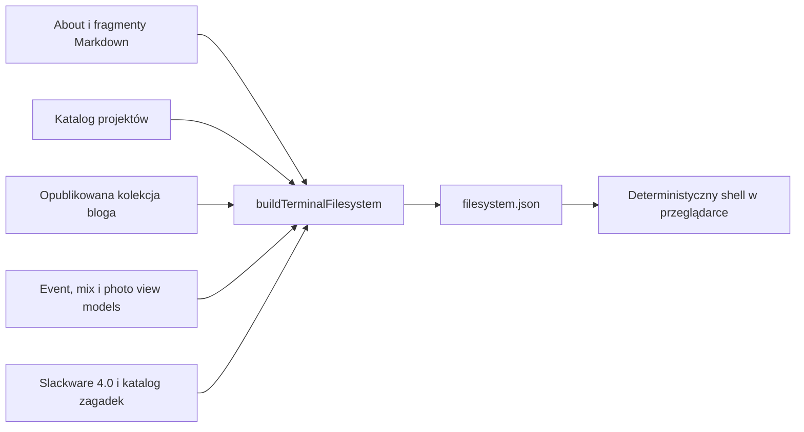

# Terminal portfolio

## Cel dokumentu

Ten dokument opisuje wysokopoziomową architekturę terminala na
`fmmaciej.com`: jego dwa tryby wizualne, wirtualny system plików, deterministyczny
shell, integrację z nawigacją strony oraz granice odpowiedzialności komponentów.

> Przed analizą ukrytych interakcji, testów, fixture'ów lub danych terminala
> należy przeczytać [`src/llms.txt`](../src/llms.txt). Ten dokument celowo nie
> opisuje ścieżek odkrywania ani rozwiązań.

Terminal jest alternatywnym interfejsem do publicznego portfolio oraz warstwą
opcjonalnych ukrytych interakcji. Nie zastępuje klasycznej nawigacji i nie jest
emulatorem prawdziwego systemu operacyjnego. Strona pozostaje w pełni użyteczna
bez aktywowania shella.

## Założenia produktu

Terminal realizuje trzy cele:

1. Buduje terminalowy charakter portfolio bez wymuszania interakcji.
2. Pozwala eksplorować te same publiczne treści za pomocą znajomych poleceń.
3. Tworzy bezpieczną, deterministyczną podstawę pod przyszłą komendę `ask`.

Aktualna wersja nie zawiera AI. Nie wykonuje prawdziwych programów, nie zapisuje
plików, nie ma dostępu do systemu użytkownika i nie interpretuje dowolnego kodu.

## Dwa tryby interfejsu

### Idle

Idle jest domyślnym stanem terminala. Odtwarza deterministyczną mieszankę
wpisów kontekstowych i globalnych bez przechwytywania klawiatury. Stała wysokość
zapobiega przesuwaniu layoutu, a fokus i hover jedynie sygnalizują możliwość
aktywacji shella.

Komenda idle pozostaje w jednej widocznej linii; za długa część jest oznaczana
wielokropkiem. Ograniczenie dotyczy tylko prezentacji idle, nie treści komendy
ani aktywnego shella.

Globalny `src/assets/terminal/config.json` ma `schemaVersion: 3`, politykę
selekcji, nazwane profile czasu oraz pule wpisów. Pliki tras mają ten sam numer
schematu i własne tablice `contextual`. Opcjonalne `runAs` i `users`
ograniczają wykonanie do właściwego kontekstu sesji. Chronione wpisy pozostają
w źródle konfiguracji i nie są wyliczane w dokumentacji.

Scheduler czeka na zakończenie tekstu lub efektu, zachowuje czas na odczyt,
wyświetla końcowe mignięcia kursora i obsługuje anulowanie jednym sygnałem.
Profile czasu są nakładane deterministycznie i walidowane przez
`terminal-idle-core.js`.

Efekty dekoracyjne korzystają ze współdzielonego modelu, są anulowalne i mają
wariant reduced motion. Szczegóły chronionych wariantów, ich podglądów
developerskich i wyzwalaczy są celowo pominięte.

### Loading, error i active shell

Aktywacja przełącza terminal do panelu interaktywnego. Manifest filesystemu
ładuje się leniwie dopiero przy pierwszej aktywacji; równoległe żądania
współdzielą jeden kontroler. Błąd pokazuje stan możliwy do ponowienia, a kolejna
aktywacja wykonuje retry.

Active shell zachowuje deterministyczny parser, historię, transcript,
autouzupełnianie, maskowany prompt uwierzytelnienia i anulowalne efekty.
Zamknięcie panelu zachowuje sesję, ale odtwarza idle. Bindingi są disposable i
bezpieczne po częściowej nawigacji.

## Architektura build-time

Wirtualny filesystem nie jest ręcznie utrzymywaną kopią portfolio. Powstaje
podczas builda z tych samych publicznych źródeł, które zasilają szablony stron.



`src/_lib/terminal/buildTerminalFilesystem.js` jest czystym builderem. Nie
mutuje wejścia i tworzy wersjonowany manifest z płaską listą wpisów.
`src/terminal-filesystem.11ty.js` jest cienką warstwą Eleventy: wczytuje
publiczne treści, przekazuje je do buildera i publikuje wynik jako:

```text
/assets/terminal/filesystem.json
```

Manifest w schemacie 2 ma `contentId`, metadane systemu, `defaultUser`, mapy
`accounts` i `groups` oraz listę wpisów. Konta zawierają UID/GID, katalog
domowy, powłokę, grupy dodatkowe i dane zagadki uwierzytelniania. `contentId`
zmienia się razem z zawartością i kontraktem kont. Plik może opcjonalnie mieć
deskryptor `media`; `ascii-video` przechowuje klatki, czas klatki i czas
zatrzymania finału bez zmiany wersji kompatybilnego schematu.

## Wirtualny system plików

Shell używa deterministycznego, tylko do odczytu manifestu systemu plików.
Publiczna gałąź odwzorowuje portfolio, a oddzielne wpisy redakcyjne zapewniają
opcjonalne ukryte interakcje. Manifest opisuje typy wpisów, właścicieli, grupy,
uprawnienia, daty, cele nawigacji i dozwolone akcje.

Manifest schematu 2 oraz konfiguracje idle schematu 3 rozpoczynają się od
addytywnego pola `_aiPolicy`. Pole zawiera wyłącznie adres polityki i neutralne
ostrzeżenie, nie uczestniczy w `contentId` i jest ignorowane przez parser,
selektor oraz pozostałą logikę runtime. Konsumenci zachowują zgodność z
zasobami, które tego pola nie mają.

Szczegółowa topologia chronionych wpisów, narracyjne dane dostępowe i kolejność
odkrywania nie należą do dokumentacji architektury. Ich źródłem prawdy pozostaje
kod i katalog redakcyjny, a przed ich analizą obowiązuje
[polityka no-spoiler](../src/llms.txt).

Uprawnienia wirtualnych kont służą narracji i deterministycznemu modelowaniu
powłoki; nie są granicą bezpieczeństwa. Dane wymagane przez klienta są
publiczne, a interfejs nie wykonuje prawdziwych operacji systemowych.

Idle może prezentować wyłącznie zamierzone, powierzchowne wskazówki. Smoke test
porównuje publiczny listing z poleceniem wykonanym na wygenerowanym manifeście,
aby konfiguracja idle i filesystem nie rozchodziły się bez kopiowania
chronionej sekwencji do dokumentacji.

### Źródła treści

- `about.md` i teksty muzyczne pochodzą z istniejących fragmentów Markdown;
- projekty są generowane z katalogu projektów i zawierają `README.md`, stack,
  status oraz publiczne linki;
- blog zawiera wyłącznie opublikowane wpisy, bez draftów i frontmatteru;
- events, mixes i photos odwzorowują pełne publiczne katalogi oraz media;
- CV i pliki `.url` prowadzą do istniejących publicznych zasobów;
- systemowe pliki w `/etc`, `/proc` i `/var/log` są bezpieczną, statyczną
  atrapą budującą kontekst.
- `src/_data/terminal/puzzles.json` jest redakcyjnym źródłem chronionych
  materiałów; testy kontraktu nie powinny kopiować jego treści.

W filesystemie nie mogą pojawiać się informacje, których nie ma w publicznych
źródłach strony. Dodanie nowego projektu do shella wymaga najpierw dodania go do
normalnego katalogu portfolio.

### Typy wpisów

Manifest rozróżnia:

| Typ | Zastosowanie |
| --- | --- |
| `directory` | Katalogi systemowe i sekcje portfolio. |
| `file` | Markdown, tekst, linki, media i dokumenty. |
| `symlink` | Linuksowe aliasy ścieżek, np. polecenia w `/bin`. |
| `device` | Kontrolowane atrapy `/dev/null`, `/dev/tty` itd. |
| `executable` | Widoczne wpisy odpowiadające obsługiwanym poleceniom. |

Każdy wpis posiada tryb dostępu, właściciela, grupę, datę modyfikacji i rozmiar.
Katalog `/root` oraz `/etc/shadow` demonstracyjnie egzekwują brak uprawnień.
Uprawnienia uwzględniają właściciela, grupę podstawową i grupy dodatkowe;
implementacja zachowuje bypass roota, choć konto root jest zablokowane. Cały
filesystem jest read-only.

## Deterministyczny shell

`terminal-shell-core.js` zawiera logikę niezależną od DOM:

- tokenizację bez `eval`;
- normalizację ścieżek bezwzględnych i względnych;
- obsługę katalogu domowego, katalogu bieżącego i poprzedniego;
- rozwiązywanie symlinków wraz z wykrywaniem cykli;
- sprawdzanie dostępu do plików i katalogów;
- wykonanie udokumentowanych poleceń;
- autouzupełnianie poleceń i ścieżek;
- serializację i odtwarzanie sesji.

Publiczny zestaw poleceń obejmuje pomoc, listing i odczyt plików, zmianę
katalogu, informacje o sesji, historię, czyszczenie transcriptu, otwieranie
dozwolonych celów oraz lokalny efekt wizualny. Powłoka obsługuje także
interaktywne uwierzytelnienie narracyjnych kont i izolowane wykonanie polecenia
w innym kontekście.

Pole hasła pozostaje typu `password`, nie pokazuje znaków i nie zapisuje
wprowadzonej wartości w historii, transcripcie ani trwałej sesji. Anulowanie
uwierzytelnienia nie zmienia bieżącej tożsamości.

Chronione aliasy, odpowiedzi i sekwencje celowo nie są wyliczane w tym
dokumencie. Testy mechaniki powinny używać neutralnych fixture'ów i asercji
właściwości; testy integracyjne mogą odwoływać się do źródła prawdy bez
duplikowania wartości redakcyjnych.

### Efekt wizualny

`terminal-matrix.js` modeluje dekoracyjny efekt wykonywany lokalnie na canvasie.
Nie uruchamia procesu, nie mutuje filesystemu i nie zapisuje klatek w
transcripcie. Idle i aktywny shell korzystają z jednego modułu modelującego
kolumny, prędkości i wygaszane ogony.

Efekt aktywnego shella kończy się automatycznie albo po anulowaniu. Canvas jest
dekoracyjny dla technologii asystujących, a status live informuje o uruchomieniu
i sposobie przerwania. Przy reduced motion wyświetlana jest statyczna klatka.

Chronione warianty korzystają z tych samych koordynatorów czasu i anulowania,
ale ich wyzwalacze oraz przebieg są pominięte zgodnie z polityką no-spoiler.

## Integracja ze stroną

Shell i klasyczna strona korzystają ze wspólnej mapy tras. Katalog lub plik może
mieć przypisane `route` i `openUrl`; zmiana katalogu może zsynchronizować URL
bez zamykania shella, a otwarcie celu wraca do idle. Wpisy bez trasy zmieniają
wyłącznie stan wirtualnego filesystemu.

Klasyczne kliknięcia mogą prezentować syntetyczny podgląd polecenia w kontekście
wymaganej tożsamości, ale zawsze przywracają wcześniejszą sesję. Szczegółowe
sekwencje chronionych tożsamości nie należą do dokumentacji.

`transitions.js` zachowuje DOM terminala podczas miękkiej nawigacji, podmienia
`.content-host`, synchronizuje zasoby strony i aktualizuje konfigurację idle.
Nowsza nawigacja anuluje starszą, a nieaktualna odpowiedź nie może zmienić DOM,
historii ani sesji. Błąd sieci, dokumentu lub wymaganego zasobu uruchamia zwykłą
nawigację przeglądarki.

## Runtime i odpowiedzialności

| Obszar | Odpowiedzialność |
| --- | --- |
| `terminal.js` | Animator idle, ścieżka strony, zegar, output w tle i lifecycle. |
| `terminal-idle-core.js` | Selekcja pul, profile tempa i sekwencyjny scheduler idle. |
| `terminal-matrix.js` | Współdzielony model i canvas dekoracyjnego efektu Matrixa. |
| `terminal-ascii-video.js` | Anulowalne odtwarzanie tekstowych klatek z obsługą reduced motion. |
| `terminal-shell-core.js` | Czysta logika filesystemu, parsera, komend i sesji. |
| `terminal-shell-coordinator.js` | Współdzielone ładowanie manifestu i stany runtime. |
| `terminal-shell.js` | DOM aktywnego shella, fokus, klawiatura, transcript i akcje. |
| `terminal-actions*.js` | Terminalowa prezentacja zwykłych kliknięć na stronie. |
| `navigation-coordinator.js` | Anulowanie, kolejność i fallback nawigacji. |
| `transitions.js` | Nawigacja HTML, historia i zachowanie terminala między trasami. |
| `terminal.css` | Stały idle, chronione efekty krokowe, hover/focus affordance oraz rozwinięty panel active. |

Inicjalizacja jest odporna na wielokrotne wywołanie. Binding aktywatora powstaje
synchronicznie, jeszcze przed pobraniem manifestu. Przy przejściu do kolejnej
strony komponent odpina poprzednie listenery i timery, wiąże trwały kontroler z
aktualnym DOM i nie tworzy równoległych cykli animacji.

`boot.js` jest ładowany raz przez layout. Uruchamia animację przy każdym pełnym
załadowaniu dokumentu, ale nie podczas częściowej nawigacji. Idempotentny
kontroler chroni przed wieloma overlayami i czyści wszystkie timery; reduced
motion pomija animowaną sekwencję.

Efekty aktywnego shella korzystają ze wspólnego kontraktu `start`, `finished`
i `cancel`. Shell blokuje input, ustawia `aria-busy`, publikuje tekstowy status
i anuluje efekt przy przerwaniu, zwinięciu, zmianie bindingu lub nawigacji.
`cmatrix` zachowuje dotychczasowy canvas, natomiast `xanim` odtwarza pliki z
deskryptorem `ascii-video` i po zakończeniu zapisuje ostatnią klatkę w
transcripcie. Przy reduced motion od razu pokazuje dostępny finał.

## Trwała sesja

Sesja jest zapisywana lokalnie pod kluczem `terminalShell:v2`.
Nie opuszcza urządzenia użytkownika.

Zapisywane są:

- bieżący użytkownik, `cwd` i poprzedni katalog;
- stos ramek interaktywnych logowań;
- maksymalnie 100 poleceń historii;
- maksymalnie 100 bloków transcriptu;
- identyfikator wersji manifestu i aktor każdego bloku transcriptu.

Transcript ma limit 200 KB. Najstarsze bloki są usuwane, a pojedynczy output
większy od limitu nie jest odtwarzany po kolejnej wizycie. W bieżącej sesji
`cat` nadal pokazuje pełny plik.

Hasła i niedokończone uwierzytelnienie nie są zapisywane. Tryb active i
niedokończony input także nie są trwałe. Każda wizyta wizualnie
zaczyna się od idle. Uszkodzony zapis, nieznana wersja albo nieistniejący `cwd`
powodują bezpieczny reset do `/home/guest`. Stary klucz v1 jest usuwany.

## Klawiatura, dostępność i responsywność

- Tab przenosi fokus na aktywator, Enter/Space otwiera shell;
- w aktywnym shellu Tab autouzupełnia, strzałki przeglądają historię;
- Escape zwija terminal albo anuluje prompt hasła, `Ctrl+L` czyści transcript,
  a `Ctrl+C` czyści input, anuluje hasło albo przerywa aktywny efekt;
- aktywator utrzymuje `aria-expanded`, transcript ma semantykę logu, a input
  posiada etykietę dla technologii asystujących;
- fokus nie jest zamykany w terminalu jak w modalu;
- `prefers-reduced-motion` usuwa niepotrzebne przejścia;
- active ma ograniczoną wysokość i własny scroll, większy względny limit na
  urządzeniach mobilnych;
- ramki hover/focus i active nie zmieniają wymiarów layoutu.

## Bezpieczeństwo i granice

Shell nie jest sandboxem dla obcego kodu, ponieważ żadnego kodu nie wykonuje.
Wspierane polecenia zwracają dane lub deskryptor dozwolonej akcji. Wszystkie
wyniki są renderowane przez `textContent`, a nie jako HTML.

Najważniejsze ograniczenia:

- brak zapisu i mutacji filesystemu;
- brak prawdziwych procesów i dostępu do urządzenia;
- brak `eval`, potoków, przekierowań i substytucji;
- otwierane są wyłącznie cele zapisane w publicznym manifeście;
- pliki chronione i urządzenia zwracają kontrolowane wyniki;
- AI i komenda `ask` pozostają poza aktualnym kontraktem.
- narracyjne dane dostępowe i chronione treści są obecne w publicznych zasobach
  klienta, więc polityka no-spoiler jest dobrowolną wskazówką dla
  współpracujących agentów, a nie techniczną granicą bezpieczeństwa.

## Rozszerzanie

### Nowe treści

Najpierw należy dodać treść do właściwego źródła portfolio. Builder terminala
powinien jedynie odwzorować publiczny model, bez tworzenia drugiej redakcyjnej
bazy danych.

### Nowa komenda deterministyczna

Komenda powinna zostać dodana do czystego rdzenia, autouzupełniania oraz atrapy
katalogów poleceń. Zwykłe komendy trafiają również do `help`, natomiast
zamierzone komendy ukryte mogą pozostać wyłącznie w completion. Komenda musi
zwracać tekst lub jawny deskryptor akcji, a jej zachowanie wymaga testów
jednostkowych.

Obecnie miejsca te są synchronizowane ręcznie. Następny refaktor ma zastąpić je
rejestrem komend. Renderery mają już ogólny kontrakt lifecycle; nowe efekty
powinny dostarczać osobny helper zamiast rozszerzać wyspecjalizowany moduł
Matrixa. Szczegółowy zakres dalszych porządków znajduje się w
[docs/todo.md](todo.md).

### Przyszłe `ask`

`ask` powinno pozostać pojedynczą komendą korzystającą wyłącznie z publicznych
treści manifestu lub ich źródeł. Awaria AI nie może wpływać na pozostałe
komendy, nawigację ani idle. Odpowiedzi powinny wskazywać źródła i odmawiać
odpowiedzi, jeśli portfolio nie zawiera wymaganych informacji.

Publiczny `/llms.txt` komunikuje zewnętrznym modelom politykę bez spoilerów, ale
ma charakter dobrowolny. Własne `ask` musi egzekwować tę politykę poza modelem:
chronione treści, ścieżki i rozwiązania nie mogą trafiać do jego kontekstu, a
reguły aplikacji mają blokować próby ich wydobycia bez potwierdzania domysłów i
udzielania wskazówek. Szczegółowe zadania zapisano w
[docs/todo.md](todo.md).

## Testowanie i walidacja

`npm run test:terminal` uruchamia testy buildera filesystemu, parsera, poleceń,
uprawnień, sesji, selektora idle, profili czasu, schedulera oraz rendererów
Matrixa i ASCII video.
Testy mechanizmu korzystają z neutralnych fixture'ów i asercji właściwości,
natomiast katalog redakcyjny ma osobny test schematu bez kopiowania jego treści.

Po `npm run build`, `npm run test:smoke` sprawdza spójność publicznego
listingu, publikację `/llms.txt`, sygnały polityki w HTML i `robots.txt` oraz
pole `_aiPolicy` we wszystkich publicznych JSON-ach terminala.
`npm run test:e2e` obejmuje lazy loading, retry, nawigację, fokus,
uwierzytelnienie bez utrwalania wpisanych wartości, anulowanie efektów, cleanup
oraz reduced motion w Chromium i WebKit.

Zmiana schematu manifestu, komend, sesji, profili, dostępności lub integracji z
nawigacją wymaga aktualizacji tej dokumentacji i odpowiedniego zestawu testów.
Chronione dane mogą pozostać w testach integracyjnych wyłącznie przez odwołanie
do źródła prawdy, bez duplikowania gotowej sekwencji odkrywania.

## Niezmienniki

- Klasyczne portfolio działa niezależnie od shella.
- Idle i active korzystają z tych samych prawdziwych ścieżek oraz komend.
- Wirtualny filesystem zawiera wyłącznie dane publiczne.
- Shell pozostaje deterministyczny, read-only i bezpieczny po stronie klienta.
- Nawigacja nie niszczy aktywnej sesji terminala.
- `src/` pozostaje źródłem prawdy; wygenerowany `www/` nie jest edytowany.
